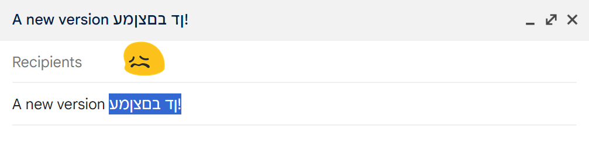
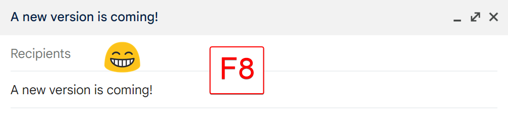
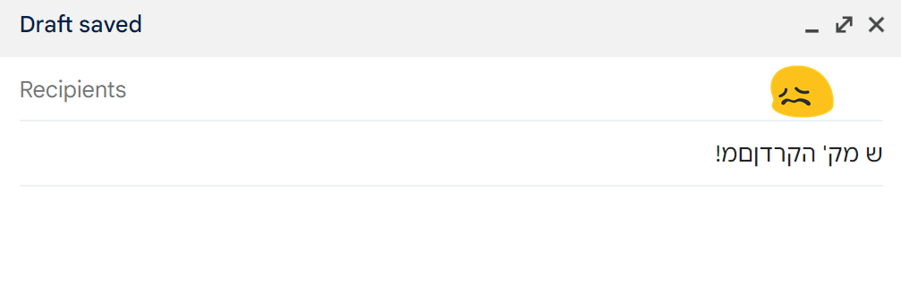
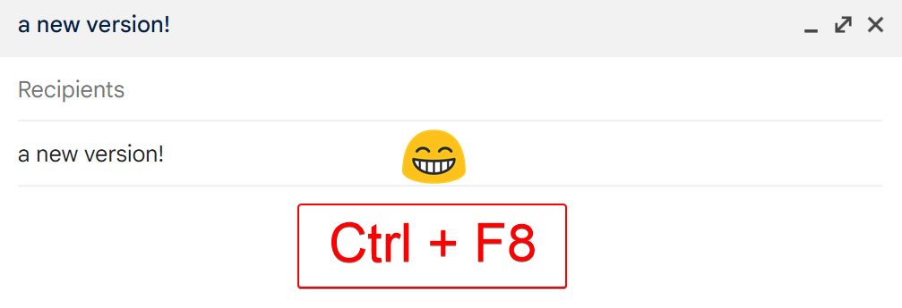

# Ba'afucha - Keyboard Layout Converter

Ba'afucha is a tiny program that provides an easy way to convert text between English and Hebrew keyboard layouts. It runs in the background and can be activated with a simple key press.

## Screenshots - F8 to convert selected text

### Before



### After



## Screenshots - Ctrl + F8 to convert all text

### Before


### After (Ctrl + F8 to convert all text)



## Features

- Automatically detects and converts text between English and Hebrew keyboard layouts
- Uses F8 key as a hotkey for conversion selected text
- Uses Ctrl + F8 key as a hotkey for conversion all text
- Runs in the system tray for easy access and management
- Preserves original clipboard content

## Requirements

- Windows operating system

## Installation

Download the latest release from the [Releases](https://github.com/matipojo/baafucha/releases) section of the repository.

## Development

1. Clone this repository or download the latest release from the [Releases](https://github.com/matipojo/baafucha/releases) page.

2. If you're running from source, install the required packages:

   ```
   pip install -r requirements.txt
   ```

## Usage

1. If you downloaded the release version, simply run the `Baafucha.exe` file.

2. If you're running from source, run the script:

   ```
   python baafucha.py
   ```

3. The script will run in the background with an icon in the system tray.

4. To convert text:
   - Select the text you want to convert
   - Press F8 to convert the selected text
   - Press Ctrl + F8 to convert all text
   - The text will be automatically converted between English and Hebrew layouts

5. To exit the program, right-click on the system tray icon and select "Quit".

## Building from Source

To create a standalone executable for Windows:

1. Ensure you have PyInstaller installed:

   ```
   pip install pyinstaller
   ```

2. Run PyInstaller:

   ```
   pyinstaller --onefile --noconsole --name Baafucha baafucha.py
   ```

3. Find the `Baafucha.exe` in the `dist` folder.

## Continuous Integration

This project uses GitHub Actions for continuous integration. Every merge to the main branch triggers a new build and release. You can find the latest release in the [Releases](https://github.com/matipojo/baafucha/releases) section of the repository.

## Contributing

Contributions, issues, and feature requests are welcome! Feel free to check the [issues page](https://github.com/matipojo/baafucha/issues).

## License

This project is licensed under the MIT License - see the [LICENSE](LICENSE) file for details.

## Acknowledgements

Ba'afucha is an AI-generated software project, including its CI workflows and this README file.

The codebase was developed using [Claude AI](https://claude.ai) for assistance, while the project icon was created with [DALL-E](https://chatgpt.com/g/g-2fkFE8rbu-dall-e).

This unique approach showcases the potential of AI in software development and design.

A similar project for Linux can be found [here](https://github.com/ilsh1964/behafucha).
